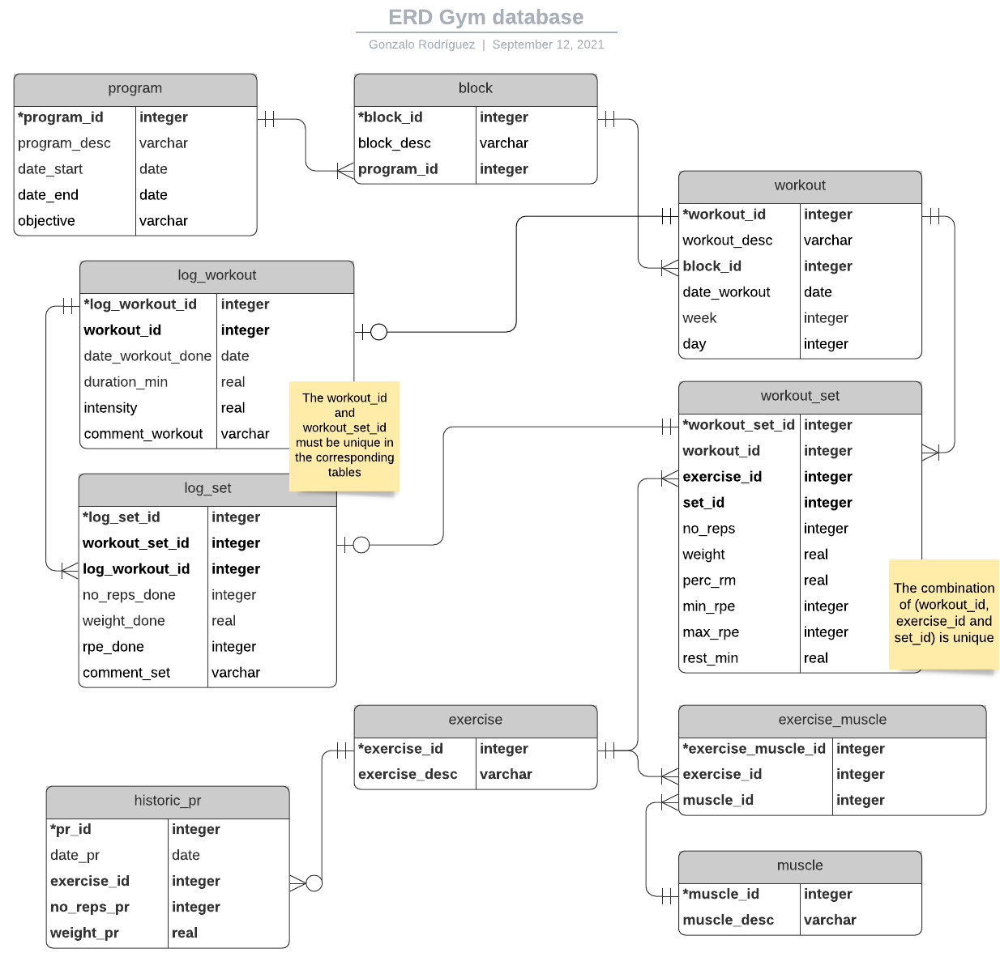

# gym-db
Messing around with SQL and NoSQL implementations for future app backend for my personal gym routines/planning

## First part: implementation of SQLite database and SQLAlchemy ORM
In this first approach we are going to build the SQL version (fully structured version) for the project using SQLite as RDBMS and SQLAlchemy to create the ORM interface with the database.

The first step in this is to create the relational model, shown in the following ERD:

